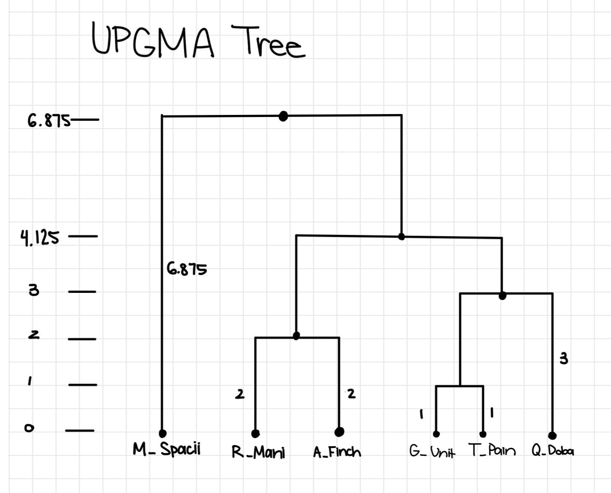
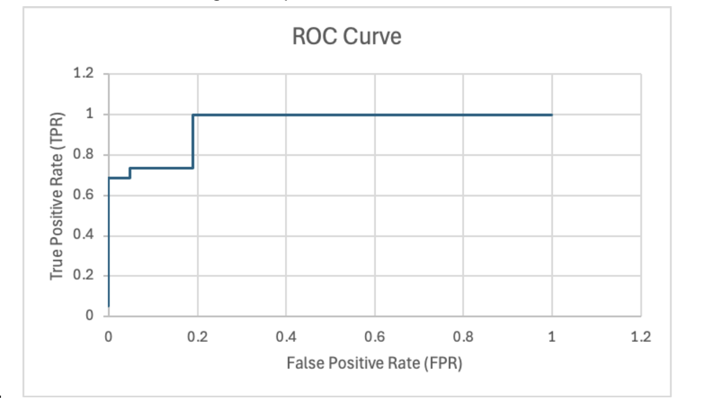

# Phylogenetics & Molecular Evolution

## Overview
This module covers two related techniques: UPGMA clustering to build a 
phylogenetic tree from pairwise distances, and a codon-based log-odds 
scoring model to classify sequences as coding or non-coding based on 
ancestor-to-descendant mutation patterns.

## UPGMA Phylogenetic Tree

Given a 6-species distance matrix, my UPGMA clustering produced the following 
tree (Newick format):
(M_Spacii:6.875,(((T_Pain:1.0,G_Unit:1.0):2.0,Q_Doba:3.0):1.125,(R_Mani:2.0,A_Finch:2.0):2.125):2.75)

The algorithm works by repeatedly merging the two closest clusters (by 
average pairwise distance) until only one cluster is left, which produces 
an ultrametric tree where all the leaves end up equidistant from the root. 
T_Pain and G_Unit clustered first since they were the most closely related 
pair, and everything else merged in progressively from there.

## Coding vs. Non-Coding Classification

I implemented log-odds scoring to classify ancestor-to-M.-Spacii codon 
transitions as coding or non-coding, using pre-trained 64x64 codon 
transition matrices for each model.

### Misclassification with Increased Divergence

Testing on the original dataset (`spacii.fa`) gave accurate 
classifications, but when I tested on a more divergent dataset 
(`spacii_2100.fa`), all sequences, including the ones that were actually 
coding, got classified as non-coding.

Here's why I think that happened:
- Coding scores for the original dataset ranged from about -50 to -85, 
  while the divergent dataset's scores ranged from about -300 to -430
- A more negative score means the coding model thinks the observed 
  mutations are increasingly unlikely to have happened in a coding region
- Coding regions are under purifying selection (mutations that mess up the 
  amino acid structure tend to get selected against), but given enough 
  evolutionary time, even coding sequences build up mutations that start 
  to look more like random, non-coding patterns
- The model was calibrated for a certain level of divergence, so applying 
  it to more divergent sequences means the probability estimates just 
  don't reflect that actual evolutionary distance anymore, which causes 
  this kind of systematic misclassification

### ROC Curve & Threshold Selection

The ROC curve shows the trade-off between true positive rate (TPR) and 
false positive rate (FPR) as I move the classification threshold:

| Threshold | TPR | FPR |
|---|---|---|
| -99.69 | 0.684 | 0.048 |
| -108.9 | 1.0 | 0.19 |

I picked -99.69 as a good threshold since it's the "elbow" of the curve, 
where TPR is as high as it can be before FPR starts climbing fast. At that 
point, about 68% of coding sequences get correctly identified and only 
about 5% of non-coding sequences get misclassified.

If I lower the threshold to -108.9, I get 100% sensitivity (no real coding 
sequences missed) but the false positive rate jumps to 19%. Since missing 
a real coding gene means losing a functional part of the analysis 
entirely, while a false positive just costs some extra time doing 
unnecessary downstream analysis, I think it makes more sense to 
**prioritize sensitivity over specificity** here.

### Model Behavior Over Evolutionary Time

As sequences diverge over longer and longer evolutionary timescales, I'd 
expect the ROC curve to flatten out toward the diagonal (TPR = FPR at 
every threshold), which would mean the model is basically no better than 
random guessing at that point. That's the same underlying issue as the 
misclassification problem above: too much divergence wipes out the signal 
that actually separates coding from non-coding mutation patterns.

## Note
Datasets are simulated for coursework purposes.