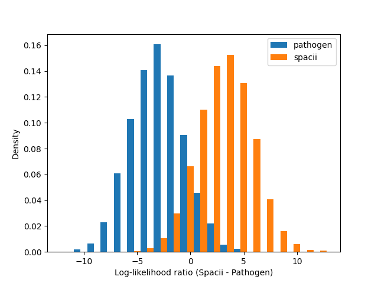
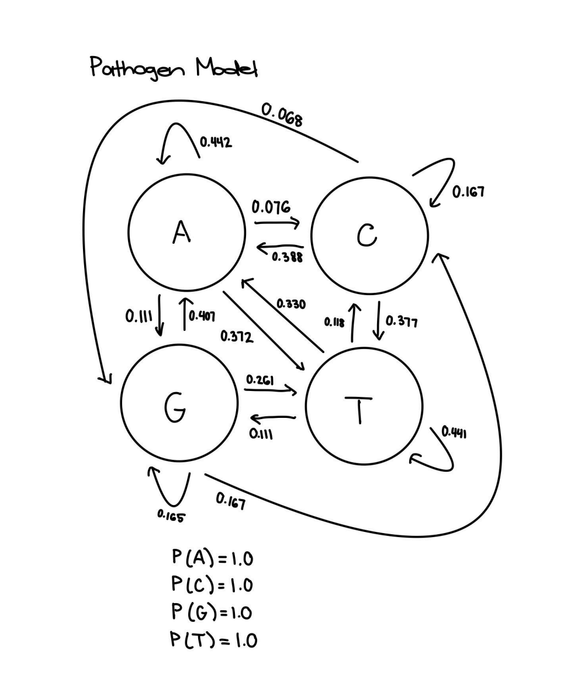
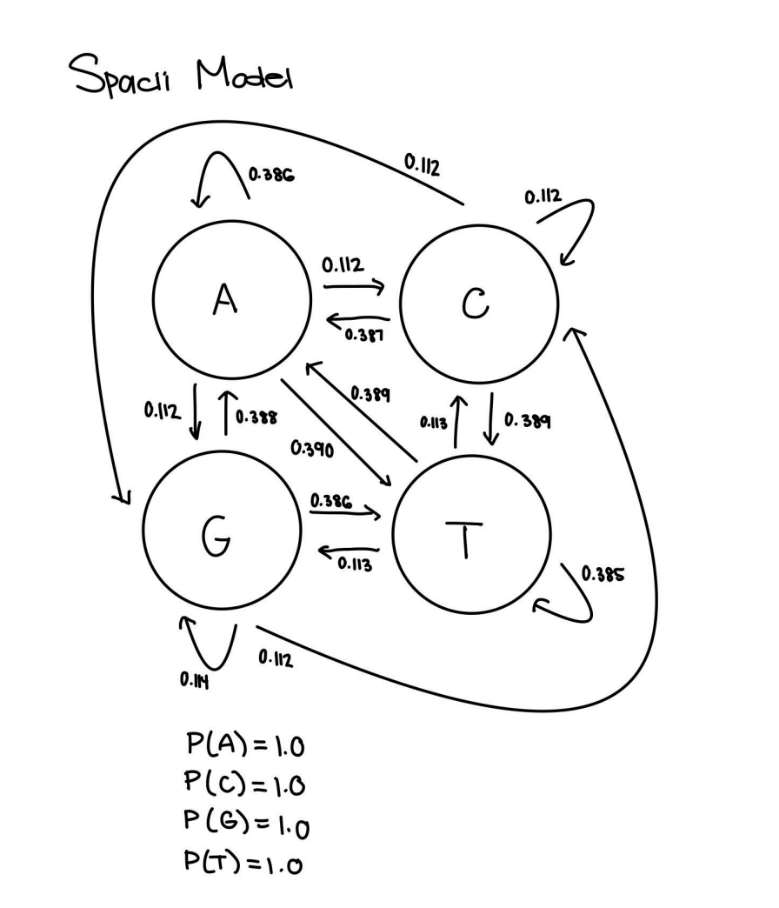
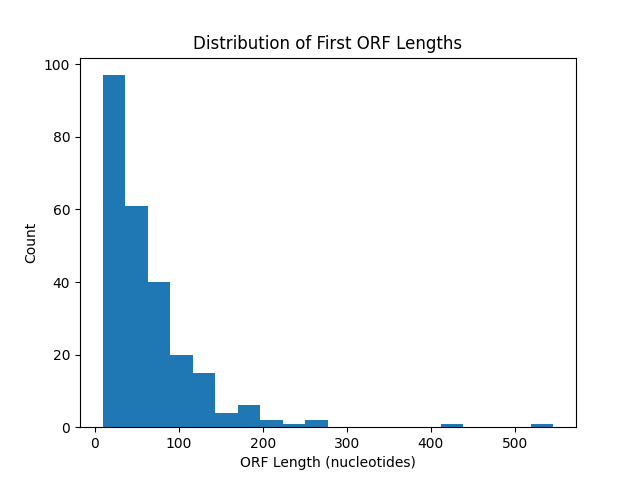

# Hidden Markov Models: Classification & Generative Modeling

## Overview
This module covers two applications of Markov models: a dinucleotide 
transition model for classifying sequences as pathogen or M. Spacii origin, 
and a 3-state generative HMM for modeling ORF structure and length 
distribution.

## Dinucleotide Classifier: Pathogen vs. M. Spacii

Trained separate 4x4 dinucleotide transition matrices for pathogen and M. 
Spacii sequences (with Laplace smoothing to avoid zero-probability issues), 
then scored test sequences using the log-likelihood ratio between the two 
models.

The resulting score distributions were well-separated: pathogen sequences 
scored mostly negative (centered around -3 to -4), while Spacii sequences 
scored mostly positive (centered around 2-4), with only slight overlap near 
zero. This separation is driven by distinct compositional biases between 
the two organisms — the pathogen model showed notably higher self-transition 
probabilities for A→A (0.442 vs. 0.386) and T→T (0.441 vs. 0.385) compared 
to Spacii, reflecting an AT-rich genome composition.

### Transition State Diagrams

### Combining Models for Chimeric Sequences

If a chimeric contig contained a merged portion of both pathogen and 
Spacii genome (e.g. from an assembly artifact), the two 4-state models 
could be combined into a single 8-state HMM — 4 states for each organism — 
with a low-probability transition connecting the two sets of states to 
represent switching between organisms at a single point in the sequence.

The Viterbi algorithm could then be used to find the most probable hidden 
state path through the chimeric sequence, using each state's emission 
probability (how well a base fits each organism's model) combined with 
transition probabilities (how likely a switch between organisms is at each 
position). The position(s) where the optimal path switches between 
organism-states mark the most likely merge point(s) in the assembly.

## Generative 3-State ORF Model

Designed a 3-state HMM (Start → Coding → Stop) to generate synthetic ORF 
sequences, with the following parameters:

- **Start → Coding**: 1.0 (an ORF always transitions to a coding region 
  immediately after the start codon)
- **Coding → Coding**: 0.95 / **Coding → Stop**: 0.05 (coding regions are 
  much more likely to continue than terminate at any given codon)
- **Stop → Start**: 1.0 (models a new ORF beginning after each stop codon)
- **Emissions**: start codon fixed to ATG (P=1.0); 61 possible coding 
  codons each equally likely (P=1/61); 3 stop codons equally likely 
  (P=1/3)

With a coding→stop transition probability of 0.05, the model predicts an 
average ORF length of ~60 nucleotides (1 stop codon expected every 20 
codons). Minimum possible ORF length is 9 nucleotides (start + 1 coding 
codon + stop), with a non-zero probability of any length up to the 
simulation's codon limit.

### Simulated ORF Length Distribution

The observed distribution matched theoretical expectations closely: most 
ORFs clustered between 0-30 nucleotides, with a right-skewed tail of 
progressively rarer, longer ORFs. This shape is a direct consequence of the 
0.95 continuation probability — while most ORFs terminate quickly, there's 
always a chance of continuing further, producing occasional long outliers 
that skew the distribution rightward. No discrepancies were found between 
expected and observed patterns, consistent with the geometric-style decay 
implied by a constant per-codon termination probability.

## Note
Datasets are simulated for coursework purposes.